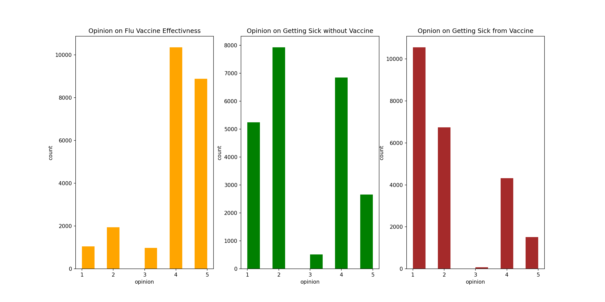
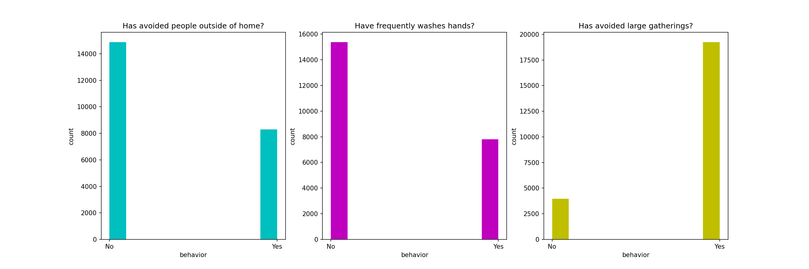
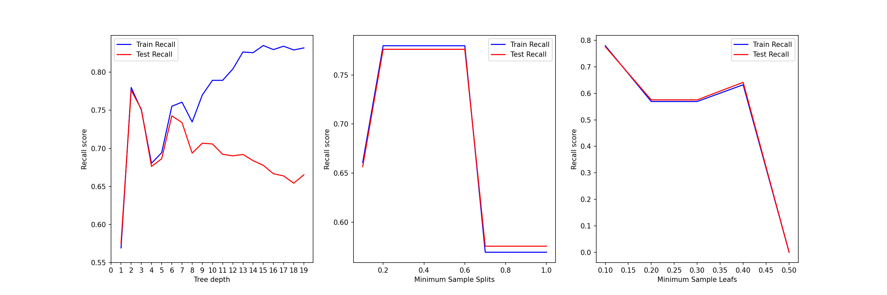

# Will they receive a flu vaccine?
by Michael Kearns

# Business Understanding
The company is prepping for the upcoming flu season. The production team wants to determine how many vaccines they need to produce to avoid over spending and reduce waste. To determine this, the plan is to gather information from a sample of individuals and classify how many of them will receive the vaccine based on their health behaviors and opinions. Previous data has been gathered about indiviauls' opnions and behaviors and whether they had received the flu vaccine in the past. By building a classification model on this previous data, this model can be used to make future classifications and predictions.

# Data Understanding
After the outbreak of the H1N1 virus, the United states conducted the [National 2009 H1N1 Flu Survey](https://www.drivendata.org/competitions/66/flu-shot-learning/). This data collected whether individuals received the H1N1 or seasonal flu vaccine as well as information on their backgrounds and health behaviors. For the purpose of this model, the data will only be used to classify if someone received the seasonal flu vaccine. 

Features of this data are primarily formatted in a binary fasion, where 1 - 'Yes' and 0 - 'No'. Multiple features are object types that will require dummy variables so they can be used in a classification model.

## Data Preparation
The dataset includes responses from 26,707 people. Some features are missing data and those will be dropped so the model does not fit to extra noise. There are also senstive features that describe the respondent's race, age, income, education background, etc. These sensitive features will not be included so that model is only fitting on the respndent's opinions and health beahviors. 

23,188 responses are leftover after cleaning the data. 13 features will be useable for the classification models. 

# Exploratory Data Analysis

The respondents' health opinions regarding the seasonal flu vaccine are distributed as below. The following values are described as:

Opinion about the effectiveness of the seasonal flu vaccine.
1 = Not at all effective; 2 = Not very effective; 3 = Don't know; 4 = Somewhat effective; 5 = Very effective.

Opinion on risk of getting sick without the vaccine, and opinion on risk of getting sick from the vaccine.
1 = Very Low; 2 = Somewhat low; 3 = Don't know; 4 = Somewhat high; 5 = Very high

People's opinions about the seasonal flu vaccine appears to be variable. Therefore this will be a good feature to use in the ML model.
 
 
The average opinion on the flu vaccine effectiveness is 4.03 - "somewhat effective"
 
The average opinion on risk of getting sick without flu vaccine is 2.73 - "somewhat low" to "don't know"
 
The everage opinion on getting sick from taking the flu vaccine is 2.12 - "somewhat low"

The respondents' distribution of health behaviors:

Percent 'Yes' from Respondents Health Beahviors: 

Has taken antiviral meds? 4.93 %
Has avoided other sick persons? 73.12 %
Has bought a face mask? 6.81 %
Has avoided large gatherings? 82.95 %
Has avoided people outside of home? 35.83 %
Have frequently washes hands? 33.69 %

People's health behaviors tend to lean more towards one action than the other. This will still be an interesting feature to include.

# ML Modeling

### Target

The goal of this model is to be able to classify whether an individual will receive the seasonal flu vaccine based on their health behaviors and opinions. This information will help the company determine how many vaccines to produce. From this model, a 'False Positive' would represent identifying someone that will choose to receive the vaccine but in fact they do not. A 'False Negative' would represent identifying someone that will choose to not receive the vaccine but they do receive it. It may be costly to over produce vaccines, but there is a greater social and medical impact if there are not enough vaccines for those who choose to receive one. Therefore, minimizing the number of 'False Negatives' is important and Recall will the evaluation metric used for this model

### Dummy Variables 

The health behaviors and opinions uses numbers but they represent actions and opinions and therefore are still considered categorical data. These columns need dummy variables so that all features have binary responses, 0 or 1. 

## Baseline Model - Logistic Regression Model
Baseline - Training Recall:  0.739
 
Baseline - Testing Recall:  0.743
 
Baseline Model Average Cross Validation Scores: 0.732

Recall numbers on Training data and testing data are similar. This shows that the model is not overfitting to the training data. Ideally though the model performs higher with better recall values. A 74% recall number means that of all the people who received the flu vaccine, 74% of them were correctly identified. The Baseline training recall and average cross validation score are similar. This shows the model is generalizing well. 

### Model 2 - Decision Tree
Decision Tree - Training Recall:  0.832
 
Decision - Testing Recall:  0.658
 
Decision Tree Average Cross Validation Scores: 0.650

The Decision tree model improved on the training data, but was worse on the test data. This shows that model is overfitting to the training data and cannot predict as well on the test data. The model training recall is slightly better than the validation score. This shows that the decision tree model is overfit slightly, and there is some noise in the data that model is training on. This model also has a lot of layers, it appears to be overly complex and simplifying the model/tuning the parameters can improve overfitting.

### Model 3 - TUNED DECISION TREE

Check for optimal tuned paramters:

 
Try max depth of 6, minimum sample split of 0.6, and minimum sample leaf value of 0.1.

Tuned Decision Tree - Training Recall:  0.780
 
Tuned Decision - Testing Recall:  0.776
 
Tuned Decision Tree Average Cross Validation Scores: 0.780

The tuned decision tree model is no longer overfitting to the training data. The validation and training recall scores are nearly identical proving that the model is not overfit. The training recall score is also nearly identical to the test recall score. The model is performing well. This example shows that on the training and test data, it correctly identified 78% of people of someone who received the seasonl flu vaccine.

# Conclusion

Model 1 - Baseline Model Test Recall: 0.743
 
Model 2 - Decision Tree Model Test Recall: 0.658
 
Model 3 - Tuned Decision Tree Model Test Recall: 0.776

## Recomendataions

As shown above, Model 3 has the best performance. Once new data is collected, we will use **Model 3** to predict if individuals from that data sample will get the seasonal flu vaccine. Obviously we cannot collect data from everyone, therefore we will use the results from the sample size to inform our manufacturing team how many vaccines to produce. 

For example, if our model predicts that 65,000 people will receive the flu vaccine from a sample size of 100,000 people, we can estimate that the actual number of people that will receive the vaccine is the predicted number divided by our model's recall score. For this example, that would be approximately 83,700 people. For this sample size we can *reduce* production by approximately **16,000 vaccines**. Extrapolating this to a larger scale, the company can save a lot of money and waste by producing a more accurate number of vaccines that will be used. 

## Limitations
There are many other factors to consider when deciding on the correct number of vaccines to produce. This model does not take into account factors such as individual's access to vaccines/clinics/health care, location, previous medical history, etc. 

## Next Steps
The next steps would be to collect data on health behaviors and opionions such that Model created can be used. 